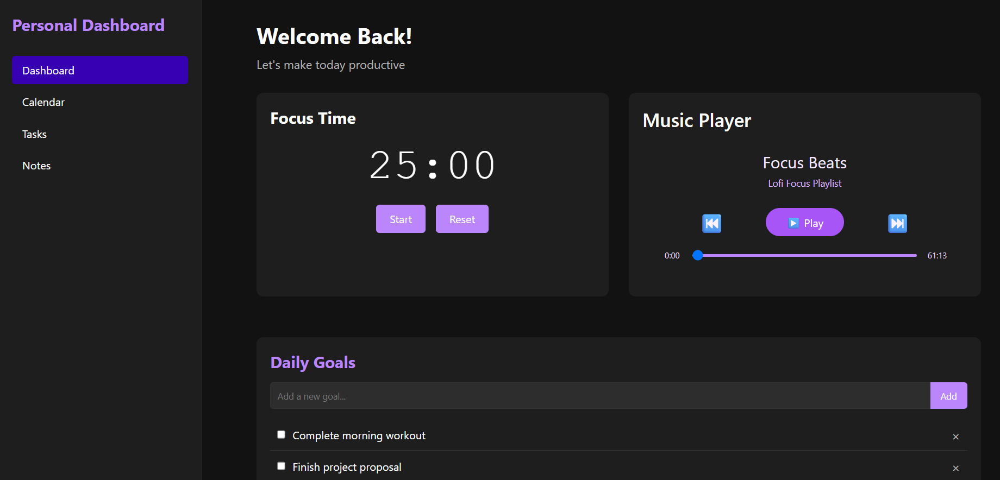
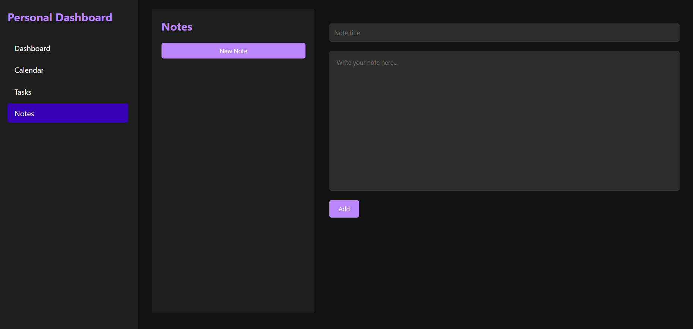
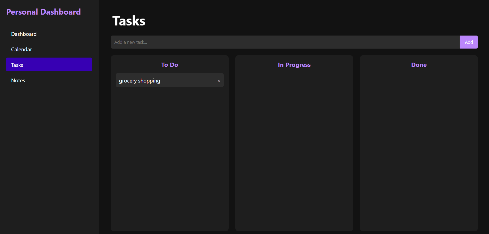
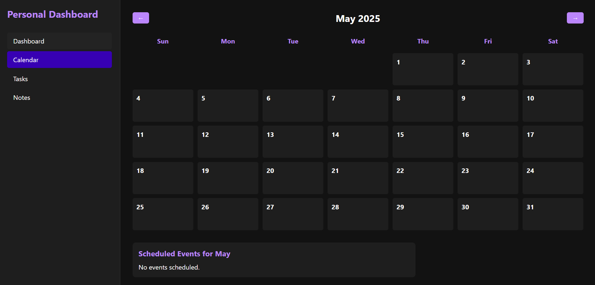

# Notoria

**Notoria** is a modern and visually engaging productivity application built with **React**, **Vite**, and **Electron**. It includes tools like note-taking, a music player, and a clean, purple-themed interface. The app is available as both a web app and desktop application.

---

## 🚀 Live Website

🔗 [View Live](https://notoria-nine.vercel.app/)

---

## 📸 Screenshots

| Home Page                           | Notes Page                        | Tasks                             | Calendar                                |
| ----------------------------------- | --------------------------------- | --------------------------------- | --------------------------------------- |
|  |  |  |  |

---

## ✨ Features

- 📝 Create, update, and delete notes
- 🎵 Built-in lofi music player with progress slider
- 🌈 Aesthetic purple-themed interface
- 💾 Notes to write down thoughts
- ⚡ Lightning-fast performance with Vite

---

## 🧱 Tech Stack

- **Frontend:** React, Vite, CSS
- **Deployment:** Vercel

---

## 💻 Installation & Setup

```bash
# Clone the repo
git clone https://github.com/Akshita3104/Personal-hub
cd PersonalHub

# Install dependencies
npm install

# Run in development
npm run dev

# Build for production
npm run build

```

🙋‍♀️ Author: Akshita Shetty. Built with 💜.
